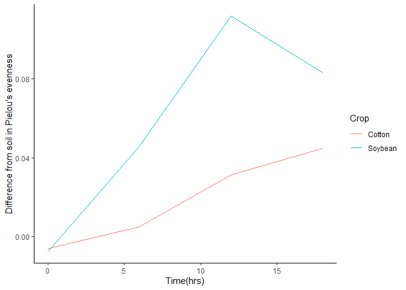

``` r
library(tidyverse)
```

    ## ── Attaching core tidyverse packages ──────────────────────── tidyverse 2.0.0 ──
    ## ✔ dplyr     1.1.4     ✔ readr     2.1.5
    ## ✔ forcats   1.0.0     ✔ stringr   1.5.1
    ## ✔ ggplot2   3.5.1     ✔ tibble    3.2.1
    ## ✔ lubridate 1.9.4     ✔ tidyr     1.3.1
    ## ✔ purrr     1.0.2     
    ## ── Conflicts ────────────────────────────────────────── tidyverse_conflicts() ──
    ## ✖ dplyr::filter() masks stats::filter()
    ## ✖ dplyr::lag()    masks stats::lag()
    ## ℹ Use the conflicted package (<http://conflicted.r-lib.org/>) to force all conflicts to become errors

#### Q1. Load in data using relative file path

``` r
diversity <- read.csv("DiversityData.csv")
str(diversity)
```

    ## 'data.frame':    70 obs. of  5 variables:
    ##  $ Code      : chr  "S01_13" "S02_16" "S03_19" "S04_22" ...
    ##  $ shannon   : num  6.62 6.61 6.66 6.66 6.61 ...
    ##  $ invsimpson: num  211 207 213 205 200 ...
    ##  $ simpson   : num  0.995 0.995 0.995 0.995 0.995 ...
    ##  $ richness  : int  3319 3079 3935 3922 3196 3481 3250 3170 3657 3177 ...

``` r
metadata <- read.csv("Metadata.csv")
str(metadata)
```

    ## 'data.frame':    70 obs. of  5 variables:
    ##  $ Code         : chr  "S01_13" "S02_16" "S03_19" "S04_22" ...
    ##  $ Crop         : chr  "Soil" "Soil" "Soil" "Soil" ...
    ##  $ Time_Point   : int  0 0 0 0 0 0 6 6 6 6 ...
    ##  $ Replicate    : int  1 2 3 4 5 6 1 2 3 4 ...
    ##  $ Water_Imbibed: chr  "na" "na" "na" "na" ...

Is something broken? Why does the chunk run with one file path, but the
knitting requires a different file path?

#### Q2. Join dataframes together by code column

``` r
alpha <- left_join(metadata, diversity, by = "Code")
head(alpha)
```

    ##     Code Crop Time_Point Replicate Water_Imbibed  shannon invsimpson   simpson
    ## 1 S01_13 Soil          0         1            na 6.624921   210.7279 0.9952545
    ## 2 S02_16 Soil          0         2            na 6.612413   206.8666 0.9951660
    ## 3 S03_19 Soil          0         3            na 6.660853   213.0184 0.9953056
    ## 4 S04_22 Soil          0         4            na 6.660671   204.6908 0.9951146
    ## 5 S05_25 Soil          0         5            na 6.610965   200.2552 0.9950064
    ## 6 S06_28 Soil          0         6            na 6.650812   199.3211 0.9949830
    ##   richness
    ## 1     3319
    ## 2     3079
    ## 3     3935
    ## 4     3922
    ## 5     3196
    ## 6     3481

#### Q3. Calculate Pielou’s Evenness (Shannon / log(richness))

``` r
alpha_even <- mutate(alpha, evenness = shannon / log(richness))
head(alpha_even)
```

    ##     Code Crop Time_Point Replicate Water_Imbibed  shannon invsimpson   simpson
    ## 1 S01_13 Soil          0         1            na 6.624921   210.7279 0.9952545
    ## 2 S02_16 Soil          0         2            na 6.612413   206.8666 0.9951660
    ## 3 S03_19 Soil          0         3            na 6.660853   213.0184 0.9953056
    ## 4 S04_22 Soil          0         4            na 6.660671   204.6908 0.9951146
    ## 5 S05_25 Soil          0         5            na 6.610965   200.2552 0.9950064
    ## 6 S06_28 Soil          0         6            na 6.650812   199.3211 0.9949830
    ##   richness  evenness
    ## 1     3319 0.8171431
    ## 2     3079 0.8232216
    ## 3     3935 0.8046776
    ## 4     3922 0.8049774
    ## 5     3196 0.8192376
    ## 6     3481 0.8155427

#### Q4. Summarize to find the mean and std error of evenness grouped by crop over time

``` r
alpha_average <- alpha_even %>%
  group_by(Crop, Time_Point) %>% 
  summarise(Mean = mean(evenness), n = n(), std.dev = sd(evenness)) %>% 
  mutate(std.err = std.dev/sqrt(n))
```

    ## `summarise()` has grouped output by 'Crop'. You can override using the
    ## `.groups` argument.

``` r
alpha_average
```

    ## # A tibble: 12 × 6
    ## # Groups:   Crop [3]
    ##    Crop    Time_Point  Mean     n std.dev std.err
    ##    <chr>        <int> <dbl> <int>   <dbl>   <dbl>
    ##  1 Cotton           0 0.820     6 0.00556 0.00227
    ##  2 Cotton           6 0.805     6 0.00920 0.00376
    ##  3 Cotton          12 0.767     6 0.0157  0.00640
    ##  4 Cotton          18 0.755     5 0.0169  0.00755
    ##  5 Soil             0 0.814     6 0.00765 0.00312
    ##  6 Soil             6 0.810     6 0.00587 0.00240
    ##  7 Soil            12 0.798     6 0.00782 0.00319
    ##  8 Soil            18 0.800     5 0.0104  0.00465
    ##  9 Soybean          0 0.822     6 0.00270 0.00110
    ## 10 Soybean          6 0.764     6 0.0400  0.0163 
    ## 11 Soybean         12 0.687     6 0.0643  0.0263 
    ## 12 Soybean         18 0.716     6 0.0153  0.00626

#### Q5. Calculate the difference between the mean evenness of the crop types and soil at each time point

``` r
alpha_average2 <- alpha_average %>%
  select(Crop, Time_Point, Mean) %>%
  pivot_wider(names_from = Crop, values_from = Mean) %>% 
  mutate(diff.soybean.even = Soil-Soybean) %>%
  mutate(diff.cotton.even = Soil-Cotton)
alpha_average2
```

    ## # A tibble: 4 × 6
    ##   Time_Point Cotton  Soil Soybean diff.soybean.even diff.cotton.even
    ##        <int>  <dbl> <dbl>   <dbl>             <dbl>            <dbl>
    ## 1          0  0.820 0.814   0.822          -0.00740         -0.00602
    ## 2          6  0.805 0.810   0.764           0.0459           0.00507
    ## 3         12  0.767 0.798   0.687           0.112            0.0313 
    ## 4         18  0.755 0.800   0.716           0.0833           0.0449

#### Q6. Create a plot

``` r
alpha_average2 %>%
  select(diff.soybean.even, diff.cotton.even, Time_Point) %>%
  pivot_longer(cols = c(diff.soybean.even, diff.cotton.even), names_to = "diff") %>%
  ggplot(aes(x=Time_Point, y = value, color = diff)) +
  geom_line() +
  xlab("Time(hrs)") +
  ylab("Difference from soil in Pielou's evenness") +
  theme_classic() +
  scale_color_discrete(name = "Crop", labels = c("Cotton", "Soybean"))
```

<!-- -->
