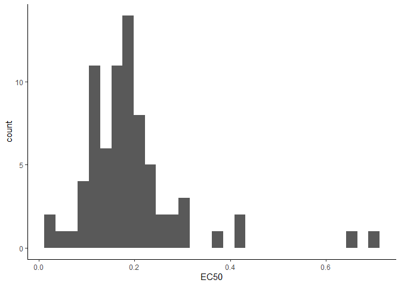

load in packages

``` r
library(ggplot2)
library(tidyverse)
```

    ## ── Attaching core tidyverse packages ──────────────────────── tidyverse 2.0.0 ──
    ## ✔ dplyr     1.1.4     ✔ readr     2.1.5
    ## ✔ forcats   1.0.0     ✔ stringr   1.5.1
    ## ✔ lubridate 1.9.4     ✔ tibble    3.2.1
    ## ✔ purrr     1.0.2     ✔ tidyr     1.3.1
    ## ── Conflicts ────────────────────────────────────────── tidyverse_conflicts() ──
    ## ✖ dplyr::filter() masks stats::filter()
    ## ✖ dplyr::lag()    masks stats::lag()
    ## ℹ Use the conflicted package (<http://conflicted.r-lib.org/>) to force all conflicts to become errors

## Functions

convert f to c

``` r
# (5*(degree_f - 32)/9)
(5*(89 - 32)/9) #could lead to copy and paste errors if you need to run this code a lot 
```

    ## [1] 31.66667

``` r
#Solution- make a function! 

F_to_C <- function(f_temp){
  celsius <- (5*(f_temp - 32)/9)
  return(celsius)
}

F_to_C(32)
```

    ## [1] 0

## Iterations - Loops!

can prevent copy and paste errors

### Interation Functions

``` r
#repeat elements easily
rep("A", 3) #repeats value A 3 times
```

    ## [1] "A" "A" "A"

``` r
rep(c("A", "B"), 10) #repeats 10 times A B A B 
```

    ##  [1] "A" "B" "A" "B" "A" "B" "A" "B" "A" "B" "A" "B" "A" "B" "A" "B" "A" "B" "A"
    ## [20] "B"

``` r
rep(c(1,2,5,3), 4, each = 5) #repeats sequence in order, 5 times for each number
```

    ##  [1] 1 1 1 1 1 2 2 2 2 2 5 5 5 5 5 3 3 3 3 3 1 1 1 1 1 2 2 2 2 2 5 5 5 5 5 3 3 3
    ## [39] 3 3 1 1 1 1 1 2 2 2 2 2 5 5 5 5 5 3 3 3 3 3 1 1 1 1 1 2 2 2 2 2 5 5 5 5 5 3
    ## [77] 3 3 3 3

``` r
#write sequences of numbers easily
1:7
```

    ## [1] 1 2 3 4 5 6 7

``` r
seq(from = 1, to = 7)
```

    ## [1] 1 2 3 4 5 6 7

``` r
seq(from = 0, to = 10, by = 2) #counts by twos 
```

    ## [1]  0  2  4  6  8 10

``` r
#make a sequence of numbers based on a character vector, helpful in loops
LETTERS #built in character vector of each letter in the alphabet
```

    ##  [1] "A" "B" "C" "D" "E" "F" "G" "H" "I" "J" "K" "L" "M" "N" "O" "P" "Q" "R" "S"
    ## [20] "T" "U" "V" "W" "X" "Y" "Z"

``` r
seq_along(LETTERS) #returns 1 - 26 for each letter in the alphabet 
```

    ##  [1]  1  2  3  4  5  6  7  8  9 10 11 12 13 14 15 16 17 18 19 20 21 22 23 24 25
    ## [26] 26

### The For Loop !

``` r
for (i in 1:10){
  print(i*2)
}
```

    ## [1] 2
    ## [1] 4
    ## [1] 6
    ## [1] 8
    ## [1] 10
    ## [1] 12
    ## [1] 14
    ## [1] 16
    ## [1] 18
    ## [1] 20

``` r
#can use a function within a loop
for (i in -30:100){
  result <- F_to_C(i)
  print(result)
}
```

    ## [1] -34.44444
    ## [1] -33.88889
    ## [1] -33.33333
    ## [1] -32.77778
    ## [1] -32.22222
    ## [1] -31.66667
    ## [1] -31.11111
    ## [1] -30.55556
    ## [1] -30
    ## [1] -29.44444
    ## [1] -28.88889
    ## [1] -28.33333
    ## [1] -27.77778
    ## [1] -27.22222
    ## [1] -26.66667
    ## [1] -26.11111
    ## [1] -25.55556
    ## [1] -25
    ## [1] -24.44444
    ## [1] -23.88889
    ## [1] -23.33333
    ## [1] -22.77778
    ## [1] -22.22222
    ## [1] -21.66667
    ## [1] -21.11111
    ## [1] -20.55556
    ## [1] -20
    ## [1] -19.44444
    ## [1] -18.88889
    ## [1] -18.33333
    ## [1] -17.77778
    ## [1] -17.22222
    ## [1] -16.66667
    ## [1] -16.11111
    ## [1] -15.55556
    ## [1] -15
    ## [1] -14.44444
    ## [1] -13.88889
    ## [1] -13.33333
    ## [1] -12.77778
    ## [1] -12.22222
    ## [1] -11.66667
    ## [1] -11.11111
    ## [1] -10.55556
    ## [1] -10
    ## [1] -9.444444
    ## [1] -8.888889
    ## [1] -8.333333
    ## [1] -7.777778
    ## [1] -7.222222
    ## [1] -6.666667
    ## [1] -6.111111
    ## [1] -5.555556
    ## [1] -5
    ## [1] -4.444444
    ## [1] -3.888889
    ## [1] -3.333333
    ## [1] -2.777778
    ## [1] -2.222222
    ## [1] -1.666667
    ## [1] -1.111111
    ## [1] -0.5555556
    ## [1] 0
    ## [1] 0.5555556
    ## [1] 1.111111
    ## [1] 1.666667
    ## [1] 2.222222
    ## [1] 2.777778
    ## [1] 3.333333
    ## [1] 3.888889
    ## [1] 4.444444
    ## [1] 5
    ## [1] 5.555556
    ## [1] 6.111111
    ## [1] 6.666667
    ## [1] 7.222222
    ## [1] 7.777778
    ## [1] 8.333333
    ## [1] 8.888889
    ## [1] 9.444444
    ## [1] 10
    ## [1] 10.55556
    ## [1] 11.11111
    ## [1] 11.66667
    ## [1] 12.22222
    ## [1] 12.77778
    ## [1] 13.33333
    ## [1] 13.88889
    ## [1] 14.44444
    ## [1] 15
    ## [1] 15.55556
    ## [1] 16.11111
    ## [1] 16.66667
    ## [1] 17.22222
    ## [1] 17.77778
    ## [1] 18.33333
    ## [1] 18.88889
    ## [1] 19.44444
    ## [1] 20
    ## [1] 20.55556
    ## [1] 21.11111
    ## [1] 21.66667
    ## [1] 22.22222
    ## [1] 22.77778
    ## [1] 23.33333
    ## [1] 23.88889
    ## [1] 24.44444
    ## [1] 25
    ## [1] 25.55556
    ## [1] 26.11111
    ## [1] 26.66667
    ## [1] 27.22222
    ## [1] 27.77778
    ## [1] 28.33333
    ## [1] 28.88889
    ## [1] 29.44444
    ## [1] 30
    ## [1] 30.55556
    ## [1] 31.11111
    ## [1] 31.66667
    ## [1] 32.22222
    ## [1] 32.77778
    ## [1] 33.33333
    ## [1] 33.88889
    ## [1] 34.44444
    ## [1] 35
    ## [1] 35.55556
    ## [1] 36.11111
    ## [1] 36.66667
    ## [1] 37.22222
    ## [1] 37.77778

``` r
#what if you want to output the loop into an object 
celsius.df <- NULL #create an empty object
for (i in -30:100){
  result <- data.frame(F_to_C(i), i) #create a one row df 
  celsius.df <- rbind.data.frame(celsius.df, result) #add newest row to the celcius df in each loop 
}
```

## Real world For Loop example

Dose response curve: Nonlinear regression with s-shaped curve We are
trying to find EC50 (where fungicide reduces pop by half)

Important cols:

- isolate
- concentration of chemical
- relgrowth (col diameter compared to control)

Goal: model each isolate separately

``` r
library(drc)
# EC50.data <- read.csv("Lectures/Lecture6Iterations&Functions/EC50_all.csv")
EC50.data <- read.csv("EC50_all.csv")

# regression for one isolate
isolate1 <- drm(100 * EC50.data$relgrowth[EC50.data$is == "ILSO_5-41c"] ~ 
        EC50.data$conc[EC50.data$is == "ILSO_5-41c"], 
                       fct = LL.4(fixed = c(NA, NA, NA, NA), 
                                  names = c("Slope", "Lower", "Upper", "EC50")), 
                       na.action = na.omit)
    # outputs the summary of the paramters including the estimate, standard
    # error, t-value, and p-value outputs it into a data frame called
    # summary.mef.fit for 'summary of fit'
    summary.fit <- data.frame(summary(isolate1)[[3]])
    # outputs the summary of just the EC50 data including the estimate, standard
    # error, upper and lower bounds of the 95% confidence intervals around the
    # EC50
    EC50 <- ED(isolate1, respLev = c(50), type = "relative", 
        interval = "delta")[[1]]
    
# turn this into a loop so it does it for each isolate in the dataset and outputs EC50 
nm <- unique(EC50.data$is) #finds unique values of char vector (in this case within "is" col of our df)
nm # outputs all the isolate names

for (i in seq_along(nm)) {
  isolate1 <- drm(100 * EC50.data$relgrowth[EC50.data$is == nm[i]] ~ 
        EC50.data$conc[EC50.data$is == nm[i]], 
                       fct = LL.4(fixed = c(NA, NA, NA, NA), 
                                  names = c("Slope", "Lower", "Upper", "EC50")), 
                       na.action = na.omit)
    # outputs the summary of the paramters including the estimate, standard
    # error, t-value, and p-value outputs it into a data frame called
    # summary.mef.fit for 'summary of fit'
    summary.fit <- data.frame(summary(isolate1)[[3]])
    # outputs the summary of just the EC50 data including the estimate, standard
    # error, upper and lower bounds of the 95% confidence intervals around the
    # EC50
    EC50 <- ED(isolate1, respLev = c(50), type = "relative", 
        interval = "delta")[[1]]
    EC50
}
```

Make this more useful by saving results as an object

``` r
EC50.ll4 <- NULL

for (i in seq_along(nm)) {
  isolate1 <- drm(100 * EC50.data$relgrowth[EC50.data$is == nm[[i]]] ~ 
        EC50.data$conc[EC50.data$is == nm[[i]]], 
                       fct = LL.4(fixed = c(NA, NA, NA, NA), 
                                  names = c("Slope", "Lower", "Upper", "EC50")), 
                       na.action = na.omit)
    # outputs the summary of the paramters including the estimate, standard
    # error, t-value, and p-value outputs it into a data frame called
    # summary.mef.fit for 'summary of fit'
    summary.fit <- data.frame(summary(isolate1)[[3]])
    # outputs the summary of just the EC50 data including the estimate, standard
    # error, upper and lower bounds of the 95% confidence intervals around the
    # EC50
    EC50 <- ED(isolate1, respLev = c(50), type = "relative", 
        interval = "delta")[[1]]
    isolate.ec_i <- data.frame(nm[[i]], EC50) #df with isolate name and EC50 value 
    EC50.ll4 <- rbind.data.frame(EC50.ll4, isolate.ec_i) #Each iteration, the newly generated row is appended to this dataframe 
}
```

plot it

``` r
ggplot(EC50.ll4, aes(x = EC50)) + geom_histogram() + theme_classic()
```

    ## `stat_bin()` using `bins = 30`. Pick better value with `binwidth`.

<!-- -->

#### Loops in TidyVerse

Can do this another way by using map function in tidyverse

- Group by isolate
- nest() - creates a subdataframe for each isolate (the grouped var)
- mutate Creates col called ll.4.mod
- map() - iterates through data, basically a for loop function
- period ‘.’ inherits all of the data from those subtables
- results from the map loop are outputted into the ll.4.mod col
- mutate again to estimate EC50 from 11.4.mod col and output values into
  the new col EC50
- unnest it and pull it out of subtables - just unnesting EC50 var

Fancy way to iterate

``` r
EC50.data %>%
  group_by(is) %>%                                         
  nest() %>%                                
  mutate(ll.4.mod = map(data, ~drm(.$relgrowth ~ .$conc,        
                              fct = LL.4(fixed = c(NA, NA, NA, NA), 
                                         names = c("Slope", "Lower", "Upper", "EC50"))))) %>%
  mutate(ec50 = map(ll.4.mod, ~ED(., 
                              respLev = c(50), 
                              type = "relative",
                              interval = "delta")[[1]])) %>%
  unnest(ec50)
```
